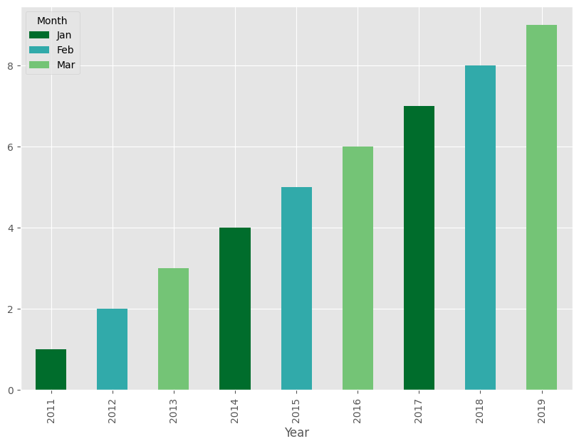
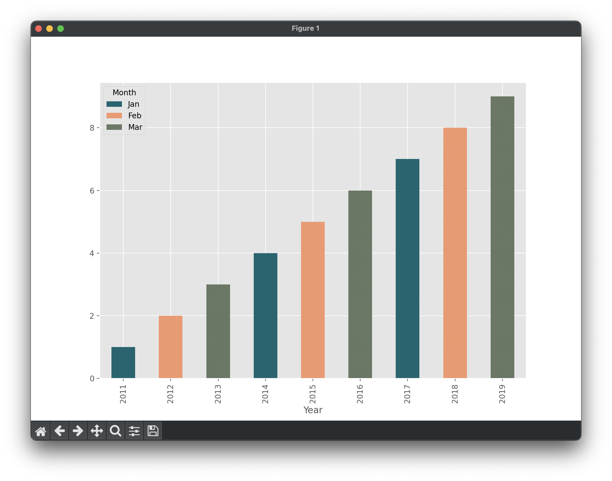

# AI-4. Integración y desarrollo adaptativo en módulos de Odoo

## Enunciado

En un ERP se necesita introducir un módulo de ventas, para lo que el Director de Negocio os pide que añadáis un módulo al informe on-line que cumpla:

## Pautas de elaboración

1. Presente gráficamente los datos en gráficas como la que se anexa abajo, donde se relacione mes con número de proyectos vendidos como Servicios Profesionales.
2. Nos piden que sea en un lenguaje abierto con Python y que usemos librerías abiertas con: Pandas, Numpy y Matplotlib que puedan ser  modificadas en cualquier momento.
3. Quieren que los colores de las barras sean de contraste por meses y que se vayan alternando secuencialmente.
4. Los datos se recogen estáticamente en series de colecciones de datos implementados en arrays con Numpy y las series serían:

```python
data = [
    [2011, 2012, 2013, 2014, 2015, 2016, 2017, 2018, 2019],
    ['Jan', 'Feb', 'Mar', 'Jan', 'Feb', 'Mar', 'Jan', 'Feb', 'Mar'],
    [1, 2, 3, 4, 5, 6, 7, 8, 9]
]
```



## Resultado actividad


